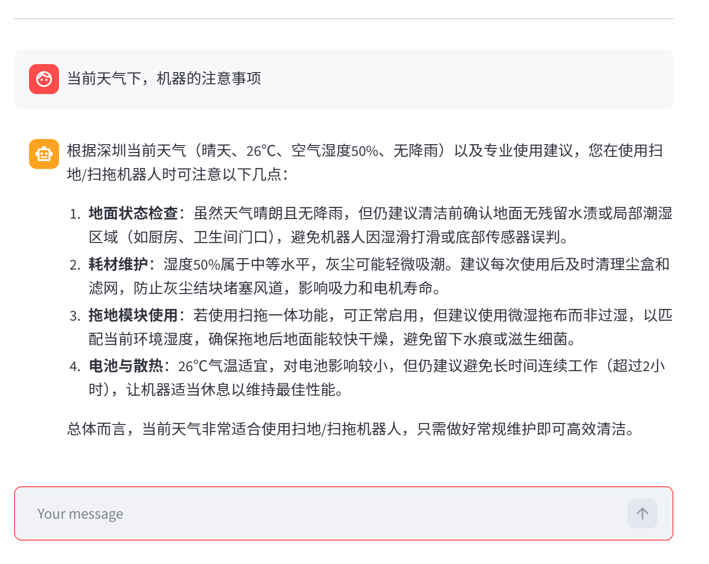

<div align="center">

# LangChain ReAct Agent · 智能客服

**基于 LangChain + ReAct 范式 + RAG 检索增强的智能客服系统，以扫地机器人为示例场景**

[](https://www.python.org/)
&nbsp;
[](https://www.langchain.com/)
&nbsp;
[](https://github.com/langchain-ai/langgraph)
&nbsp;
[](https://streamlit.io/)
&nbsp;
[](./LICENSE)

</div>

---

## 项目简介

基于 LangChain 框架实现的 **ReAct（Reasoning + Acting）Agent**，集成 RAG 检索增强、多工具调用和动态提示词切换。系统能根据用户意图自动判断任务类型（知识问答 / 报告生成），调用合适的工具和知识库完成推理，并通过 Streamlit 流式界面实时展示 Agent 的思考与执行过程。

## 效果展示

<div align="center">


*图1. 普通问答 — RAG 检索知识库回复*

&nbsp;



*图2. Agent 工具调用 — 实时展示推理与工具执行链路*

&nbsp;


*图3. 工具调用详情 — 多步推理与中间结果可视化*

&nbsp;


</div>

## 技术架构

<div align="center">

```
用户输入 (Streamlit)
      │
      ▼
┌─────────────────────────────────────────┐
│            ReAct Agent                   │
│                                          │
│  ┌──────────┐    ┌──────────────────┐   │
│  │ Thought  │───→│     Action       │   │
│  │ (推理)    │    │ (工具调用 / RAG)  │   │
│  └──────────┘    └────────┬─────────┘   │
│       ↑                   │              │
│       └─── Observation ◄──┘              │
│                                          │
│   Middleware: 工具监控 · 动态提示词切换    │
└─────────────────────────────────────────┘
      │                │              │
      ▼                ▼              ▼
┌──────────┐   ┌────────────┐  ┌──────────┐
│   RAG    │   │   Tools    │  │  Prompt  │
│  Chroma  │   │ 天气/用户   │  │  动态切换  │
│ 向量检索  │   │ 数据/报告   │  │  模板管理  │
└──────────┘   └────────────┘  └──────────┘
```

</div>

### 核心特性

| 特性 | 说明 |
|---|---|
| **ReAct 范式** | Thought → Action → Observation 循环，Agent 自主推理并决定调用哪个工具 |
| **RAG 检索增强** | Chroma 向量库 + DashScope Embedding，MD5 文件去重，支持 txt/pdf 混合加载 |
| **多工具调用** | 天气查询 / 用户定位 / 外部数据检索 / 报告上下文填充，Agent 按需自动选择 |
| **动态提示词切换** | Middleware 根据运行时上下文自动切换「普通问答」与「报告生成」两套 System Prompt |
| **流式对话界面** | Streamlit 构建，支持流式逐字输出、历史消息留存、Agent 推理过程可见 |
| **模块化结构** | Agent / RAG / Model / Tools / Middleware 独立模块，配置 YAML 驱动 |

## 技术栈

| 层级 | 技术 |
|---|---|
| LLM | 通义千问（DashScope / ChatTongyi） |
| Agent 框架 | LangChain + LangGraph |
| 向量数据库 | Chroma |
| 文档处理 | PyPDF + RecursiveCharacterTextSplitter |
| 前端 | Streamlit |
| 配置 | YAML 驱动（Agent / RAG / Chroma / Prompts） |

## 快速开始

### 环境要求

- **Python** ≥ 3.10
- **DashScope API Key**（[阿里云百炼](https://bailian.console.aliyun.com/) 申请）

### 1. 克隆仓库

```bash
git clone https://github.com/lhh737/LangChain-ReAct-Agent.git
cd LangChain-ReAct-Agent
```

### 2. 安装依赖

```bash
pip install -r requirements.txt
```

### 3. 配置 API Key

参考 `.env.example`，设置阿里云百炼 API Key：

```bash
# Linux / macOS
export DASHSCOPE_API_KEY="your-api-key"

# Windows (CMD)
set DASHSCOPE_API_KEY=your-api-key
```

> 申请地址：[阿里云百炼控制台](https://bailian.console.aliyun.com/)

### 4. 初始化知识库（首次运行）

```bash
python -c "from rag.vector_store import VectorStoreService; VectorStoreService().load_document()"
```

### 5. 启动应用

```bash
streamlit run app.py
```

浏览器自动打开  http://localhost:8501

### 验证运行

启动后在聊天框输入以下测试问题：

- *扫地机器人有哪些主要功能？*（RAG 知识库问答）
- *如果机器人无法正常回充，该如何处理？*（故障排查）
- *请根据用户数据生成一份个性化使用报告*（报告生成 + 工具调用）

## 项目结构

```
LangChain-ReAct-Agent/
│
├── agent/                          # Agent 核心
│   ├── react_agent.py              #   ReAct Agent 主逻辑（流式执行）
│   └── tools/
│       ├── agent_tools.py          #   工具函数（RAG检索/天气/用户数据/报告）
│       └── middleware.py           #   中间件（工具监控/动态提示词切换）
│
├── rag/                            # RAG 检索增强
│   ├── vector_store.py             #   Chroma 向量库 · 文档加载 · MD5 去重
│   └── rag_service.py              #   RAG 检索 → LLM 总结服务
│
├── model/
│   └── factory.py                  # 模型工厂（ChatTongyi + DashScopeEmbedding）
│
├── config/                         # YAML 配置文件
│   ├── agent.yml                   #   Agent 行为与工具配置
│   ├── chroma.yml                  #   向量库与检索参数
│   ├── prompts.yml                 #   提示词模板
│   └── rag.yml                     #   RAG 模型与参数
│
├── prompts/                        # 提示词模板
│   ├── main_prompt.txt             #   普通问答 System Prompt
│   ├── rag_summarize.txt           #   RAG 总结 Prompt
│   └── report_prompt.txt           #   报告生成 System Prompt
│
├── utils/                          # 工具函数
│   ├── config_handler.py           #   YAML 配置加载
│   ├── file_handler.py             #   文件解析（PDF/TXT）
│   ├── logger_handler.py           #   日志管理
│   ├── path_tool.py                #   路径工具
│   └── prompt_loader.py            #   提示词加载
│
├── data/                           # 知识库文档（扫地机器人相关）
├── assets/                         # 效果展示截图
├── app.py                          # Streamlit 应用入口
├── requirements.txt
└── README.md
```

## 配置说明

项目通过 `config/` 目录下的 YAML 文件统一管理配置：

| 文件 | 说明 |
|---|---|
| `rag.yml` | 对话模型名称、Embedding 模型名称 |
| `chroma.yml` | Chroma 持久化路径、分块大小、检索 Top-K、支持的文件类型 |
| `prompts.yml` | 各场景提示词模板文件路径 |
| `agent.yml` | Agent 超时时间、外部数据路径等 |

首次运行只需确保 **DashScope API Key 已设置** 且 `data/` 目录下有知识库文档即可。

## License

MIT © [lhh737](https://github.com/lhh737)
