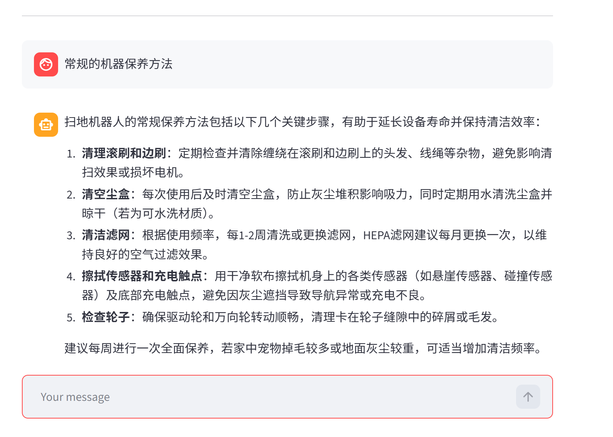

<div align="center">

# LangChain ReAct Agent · 智能客服

**基于 LangChain + ReAct 范式 + RAG 检索增强的智能客服系统，以扫地机器人为示例场景**

[](https://www.python.org/)
&nbsp;
[](https://www.langchain.com/)
&nbsp;
[](https://github.com/langchain-ai/langgraph)
&nbsp;
[](https://streamlit.io/)
&nbsp;
[](./LICENSE)

</div>

---

## 项目简介

基于 LangChain 框架实现的 ReAct Agent，集成 RAG 检索增强、多工具调用、多轮对话、提示词切换。系统能根据用户意图自动判断任务类型（知识问答 / 报告生成），调用合适的工具和知识库完成推理，并通过Streamlit 流式界面实时展示 Agent 的思考与执行过程。RAG 检索增强：采用混合检索（向量 + BM25）策略；引入DAT策略，实时调整向量与BM25的融合权重；结合Qwen3‑Reranker精排。

## 效果展示

<div align="center">



*图1. 普通问答 — RAG 检索知识库回复*

&nbsp;


*图2. Agent 工具调用 — 实时展示推理与工具执行链路*

&nbsp;


*图3. 工具调用详情 — 多步推理与中间结果可视化*

&nbsp;


</div>

## 技术架构

<div align="center">

```
用户输入 (Streamlit)
      │
      ▼
┌─────────────────────────────────────────┐
│            ReAct Agent                   │
│                                          │
│  ┌──────────┐    ┌──────────────────┐   │
│  │ Thought  │───→│     Action       │   │
│  │ (推理)    │    │ (工具调用 / RAG)  │   │
│  └──────────┘    └────────┬─────────┘   │
│       ↑                   │              │
│       └─── Observation ◄──┘              │
│                                          │
│   Middleware: 工具监控 · 动态提示词切换    │
└─────────────────────────────────────────┘
      │                │              │
      ▼                ▼              ▼
┌──────────┐   ┌────────────┐  ┌──────────┐
│   RAG    │   │   Tools    │  │  Prompt  │
│  混合检索 │   │ 天气/用户   │  │  动态切换  │
│          │   │ 数据/报告   │  │  模板管理  │
└──────────┘   └────────────┘  └──────────┘
```

</div>

### 核心特性

| 特性 | 说明 |
|---|---|
| **ReAct 范式** | Thought → Action → Observation 循环，Agent 自主推理并决定调用哪个工具 |
| **混合检索** | 同时使用向量检索（语义）和 BM25（关键词）召回，提升检索覆盖率和准确性 |
| **DAT 动态权重** | 用 LLM 评估查询与 Top-1 文档的相关性，动态调整向量与 BM25 的融合权重，无需人工预设 |
| **WRRF 融合 + 精排** | 加权倒数排名融合（WRRF）作为粗排，再用 Qwen3-Reranker 进行深度精排，确保 Top-K 文档高度相关 |
| **多工具调用** | 7 个内置工具：RAG 检索、天气查询、用户定位、用户 ID、当前月份、外部数据获取、报告上下文填充；支持工具重试（最多 3 次） |
| **多轮对话** | 基于滑动窗口（保留最近 3 轮对话）实现上下文记忆，自动过滤工具调用消息，支持“新对话”重置 |
| **动态提示词切换** | 中间件根据运行时上下文自动切换「普通问答」与「报告生成」两套 System Prompt |
| **流式交互** | Streamlit 构建，逐字输出 Agent 回复，侧边栏提供重试开关、精排开关等调试选项 |
| **模块化架构** | Agent / RAG / Tools / Middleware / Model / Utils 解耦，配置 YAML 驱动，易于扩展 |

## 技术栈
| 层级 | 技术 |
|---|---|
| LLM | 通义千问（DashScope / ChatTongyi） |
| Agent 框架 | LangChain + LangGraph |
| 向量数据库 | Chroma |
| 文档处理 | PyPDF + RecursiveCharacterTextSplitter |
| 前端 | Streamlit |
| 配置 | YAML 驱动（Agent / RAG / Chroma / Prompts） |

## 快速开始

### 环境要求

- **Python** ≥ 3.10
- **DashScope API Key**（[阿里云百炼](https://bailian.console.aliyun.com/) 申请）

### 1. 克隆仓库

```bash
git clone https://github.com/lhh737/LangChain-ReAct-Agent.git
cd LangChain-ReAct-Agent
```

### 2. 安装依赖

```bash
pip install -r requirements.txt
```

### 3. 配置 API Key

参考 `.env.example`，设置阿里云百炼 API Key：

```bash
# Linux / macOS
export DASHSCOPE_API_KEY="your-api-key"

# Windows (CMD)
set DASHSCOPE_API_KEY=your-api-key
```

> 申请地址：[阿里云百炼控制台](https://bailian.console.aliyun.com/)

### 4. 初始化知识库（首次运行）

```bash
python -c "from rag.vector_store import VectorStoreService; VectorStoreService().load_document()"
```

### 5. 启动应用

```bash
streamlit run app.py
```

浏览器自动打开  http://localhost:8501

### 验证运行

启动后在聊天框输入以下测试问题：

- *扫地机器人有哪些主要功能？*（RAG 知识库问答）
- *如果机器人无法正常回充，该如何处理？*（故障排查）
- *请根据用户数据生成一份个性化使用报告*（报告生成 + 工具调用）

## 项目结构
```
LangChain-ReAct-Agent/                    # 项目根目录
│
├── agent/                                # Agent 核心模块
│   ├── react_agent.py                    # ReAct Agent 主逻辑（流式执行，支持多轮对话）
│   └── tools/
│       ├── agent_tools.py                # 工具函数（RAG检索、天气、用户ID/位置、外部数据、报告上下文填充）
│       └── middleware.py                 # 中间件（工具调用监控、日志记录、动态提示词切换）
│
├── rag/                                  # RAG 检索增强模块
│   ├── vector_store.py                   # Chroma 向量库管理（文档加载、MD5去重、混合检索器）
│   └── rag_service.py                    # RAG 检索 → LLM 总结服务（支持混合检索、DAT动态权重、Qwen精排）
│
├── model/                                # 模型工厂
│   └── factory.py                        # 模型工厂（生成 ChatTongyi 和 DashScopeEmbedding 实例）
│
├── config/                               # YAML 配置文件
│   ├── agent.yml                         # Agent 行为与工具配置（如外部数据路径）
│   ├── chroma.yml                        # 向量库与检索参数（分块大小、Top-K、支持文件类型等）
│   ├── prompts.yml                       # 提示词模板文件路径配置
│   └── rag.yml                           # RAG 模型与参数（对话模型名、Embedding 模型名）
│
├── prompts/                              # 提示词模板
│   ├── main_prompt.txt                   # 普通问答 System Prompt（ReAct 核心指令）
│   ├── rag_summarize.txt                 # RAG 总结 Prompt（指导模型基于资料简洁回答）
│   └── report_prompt.txt                 # 报告生成 System Prompt（生成个性化使用报告）
│
├── utils/                                # 工具函数
│   ├── config_handler.py                 # YAML 配置加载（加载 agent.yml, chroma.yml, prompts.yml, rag.yml）
│   ├── file_handler.py                   # 文件解析（PDF/TXT 加载、MD5 计算、文件列表获取）
│   ├── logger_handler.py                 # 日志管理（生成按日滚动的日志文件）
│   ├── path_tool.py                      # 路径工具（获取工程根目录、相对转绝对路径）
│   └── prompt_loader.py                  # 提示词加载（读取 main_prompt.txt, rag_summarize.txt, report_prompt.txt）
│
├── data/                                 # 知识库文档（扫地机器人相关）
│   ├── external/                         # 外部数据目录
│   │   └── records.csv                   # 用户历史使用记录（CSV格式，用于报告生成）
│   ├── 扫地机器人100问.pdf
│   ├── 扫地机器人100问2.txt
│   ├── 扫拖一体机器人100问.txt
│   ├── 故障排除.txt
│   ├── 维护保养.txt
│   └── 选购指南.txt
│
├── assets/                               # 效果展示截图
│   ├── chat1.png
│   ├── chat2.png
│   └── chat3.png
│
├── app.py                                # Streamlit 应用入口（前端界面，流式输出，多轮对话管理）
├── .env.example                          # 环境变量示例（需设置 DASHSCOPE_API_KEY）
├── requirements.txt                      # Python 依赖包列表
├── README.md                             # 项目说明文档（技术架构、快速开始、配置说明等）
├── test.py                               # 测试脚本（快速验证 RAG 检索功能）
└── logs/                                 # 日志目录（自动生成，按日期保存 agent_YYYYMMDD.log）
    ├── agent_20260516.log
    └── agent_20260517.log
```

## 配置说明

项目通过 `config/` 目录下的 YAML 文件统一管理配置：

| 文件 | 说明 |
|---|---|
| `rag.yml` | 对话模型名称、Embedding 模型名称 |
| `chroma.yml` | Chroma 持久化路径、分块大小、检索 Top-K、支持的文件类型 |
| `prompts.yml` | 各场景提示词模板文件路径 |
| `agent.yml` | Agent 超时时间、外部数据路径等 |

首次运行只需确保 **DashScope API Key 已设置** 且 `data/` 目录下有知识库文档即可。

## License

MIT © [lhh737](https://github.com/lhh737)
